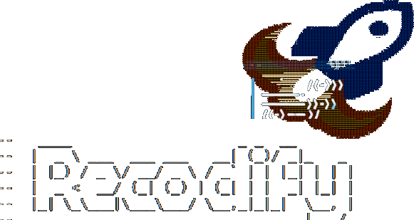

# DynamoDB CDK Migrations



CDK to DynamoDB-local bridge. Deploy your CDK defined tables locally, with zero drift.

> ⚠️ **Early MVP/POC**: This project is in very early development and serves as a proof of concept. APIs may change significantly and features are limited. Use at your own risk in production environments.

## Overview

This project provides utilities to bridge AWS CDK DynamoDB table definitions with local DynamoDB instances. It allows you to deploy and test your CDK-defined DynamoDB tables locally without any configuration drift from your production infrastructure.

## Features

- ✅ **Zero Drift**: Ensures local tables match your CDK definitions exactly
- 🔧 **CDK Integration**: Works directly with your existing CDK table definitions
- 🧪 **Testing Support**: Built-in test utilities for integration testing
- 📝 **Type Safe**: Full TypeScript support with AWS SDK v3

## Prerequisites

- Node.js (v16 or later)
- DynamoDB Local running (for testing)
- AWS CDK v2

## Installation

```bash
npm install
```

## Usage

### Basic Usage

```typescript
import { createTableInputFromTemplate } from './src/cdk/cdk-utils';
import { CreateTableCommand } from '@aws-sdk/client-dynamodb';

// Create your CDK stack and table definition
const stack = new cdk.Stack();
const table = new dynamodb.Table(stack, 'MyTable', {
  partitionKey: { name: 'id', type: dynamodb.AttributeType.STRING }
});

// Convert CDK definition to DynamoDB SDK format
const tableInput = createTableInputFromTemplate(stack, table);

// Create table in local DynamoDB
const client = new DynamoDBClient({ endpoint: 'http://localhost:8000' });
const command = new CreateTableCommand(tableInput);
await client.send(command);
```

### Project Structure

```
src/
├── cdk/
│   └── cdk-utils.ts          # Core utility functions
test/
├── helpers/
│   └── create-Connection.ts   # DynamoDB client helpers
├── cdk/
│   ├── stacks/
│   │   └── testStack.ts       # Test CDK stacks
│   └── resources/
│       └── testTableDefinition.ts  # Test table definitions
└── integration/
    └── createTable.test.ts    # Integration tests
package.json
```

## Testing

### Run Integration Tests

```bash
npm run test:integration
```

The integration tests verify that:
- Tables are created successfully from CDK definitions
- Table configurations match the CDK specifications exactly
- Key schemas and attribute definitions are preserved
- Table status is properly set to ACTIVE

### Test Requirements

- DynamoDB Local must be running on the default port (8000)
- Tests use Mocha with Chai assertions
- TypeScript compilation handled by ts-node

## API Reference

### `createTableInputFromTemplate(stack, table)`

Converts a CDK DynamoDB table definition to AWS SDK `CreateTableCommandInput`.

**Parameters:**
- `stack` (cdk.Stack): The CDK stack containing the table
- `table` (dynamodb.Table): The CDK table construct

**Returns:**
- `CreateTableCommandInput`: Ready-to-use input for AWS SDK CreateTableCommand

**Features:**
- Preserves all table properties (keys, indexes, throughput, streams)
- Handles both provisioned and on-demand billing modes
- Supports Global and Local Secondary Indexes
- Maintains stream specifications

## Development

### Dependencies

**Production:**
- `@aws-sdk/client-dynamodb`: AWS SDK v3 for DynamoDB operations
- `aws-cdk-lib`: AWS CDK v2 library
- `constructs`: CDK constructs library

**Development:**
- `mocha` + `chai`: Testing framework
- `typescript` + `ts-node`: TypeScript support
- `@types/*`: Type definitions

### Contributing

1. Fork the repository
2. Create your feature branch (`git checkout -b feature/amazing-feature`)
3. Add tests for your changes
4. Ensure all tests pass (`npm run test:integration`)
5. Commit your changes (`git commit -m 'Add amazing feature'`)
6. Push to the branch (`git push origin feature/amazing-feature`)
7. Open a Pull Request

## License

ISC

## Support

For issues, questions, or contributions, please open an issue on the project repository.